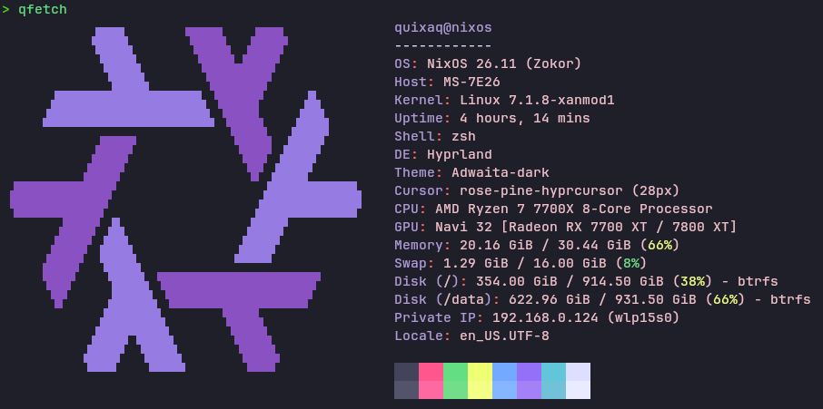

# qfetch
A blazing fast, highly configurable and lightweight fetch tool written in Rust.



## Installation
### Manual Build
```bash
cargo build --release
```
You can optionally use CONFIG_FILE_PATH=/path/to/file before the build command if you want to use a custom path for it.

### NixOS
Add qfetch to your nix flake inputs
```nix
inputs.qfetch.url = "git+https://codeberg.org/quixaq/qfetch";
```
Add the module to nixosSystem
```nix
outputs = { nixpkgs, qfetch, ... }: {
  nixosConfigurations.<hostname> = nixpkgs.lib.nixosSystem {
    modules = [
      ./configuration.nix
      qfetch.nixosModules.default
    ];
  };
};
```

## Configuration
### General
Colors can be set as either a hex color with the # (e.g. "#ffafcb", "#fff"), or an ansi foreground color code prefixed with "a" (e.g. "a31", "a95")
For `logo.include`, the first logo will be used as fallback, also remember that every logo you include will be directly included in the binary so it may increase execution time. You can see the available logos in the `logo` dir.
### Manual Build
Modify the `config.yaml` file in the project dir and rebuild.
As an alternative you could get the default `config.yaml` file from the repository and copy it anywhere else and make changes there and point the CONFIG_FILE_PATH env variable to it.
The modules are ordered in the way you order them in the config.
### NixOS
You can config directly in your `configuration.nix`.
You'll need to set the index manually due to the way the config is handled. You can use floats and the numbers don't have to be in order since it's sorted before being injected into the project dir.

Example config:
```nix
qfetch.settings = {
  modules = {
    os = { enabled = true; key = "Distro"; index = 2; }
    kernel.enabled = false;
    gpu.key = "Graphics";
    gpu.index = 3.14;
  };
  
  colors = {
    title = "#ffffff";
  };
  
  logo = {
    enabled = true;
    include = [
      { id = "nixos" colors = [ "#ffafcb" "#123456" ]; }
    ];
  };
};
```

## Benchmarks
qfetch with all modules enabled:
```bash
> hyperfine -N --warmup 2500 qfetch
Benchmark 1: qfetch
  Time (mean ± σ):       1.6 ms ±   0.1 ms    [User: 1.3 ms, System: 0.3 ms]
  Range (min … max):     1.4 ms …   2.2 ms    2176 runs
```

fastfetch with the same modules enabled:
```bash
> hyperfine -N --warmup 2500 fastfetch
Benchmark 1: fastfetch
  Time (mean ± σ):       8.1 ms ±   0.3 ms    [User: 2.3 ms, System: 5.5 ms]
  Range (min … max):     7.5 ms …   9.3 ms    362 runs
```
